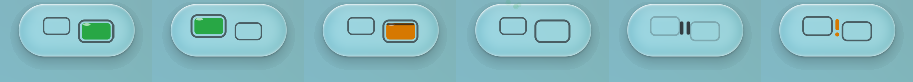
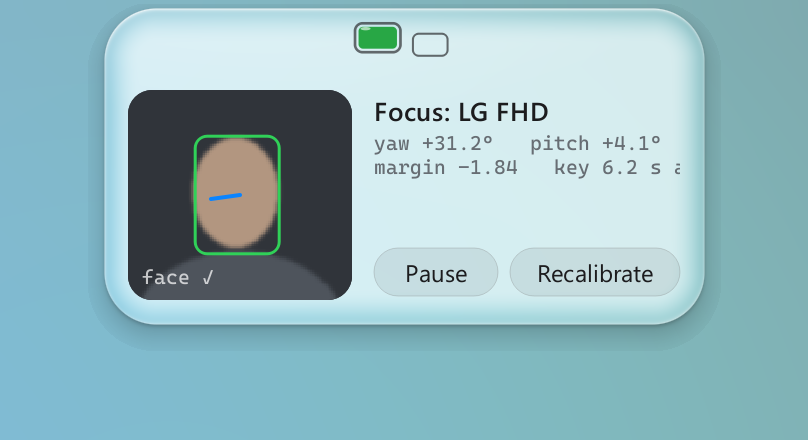
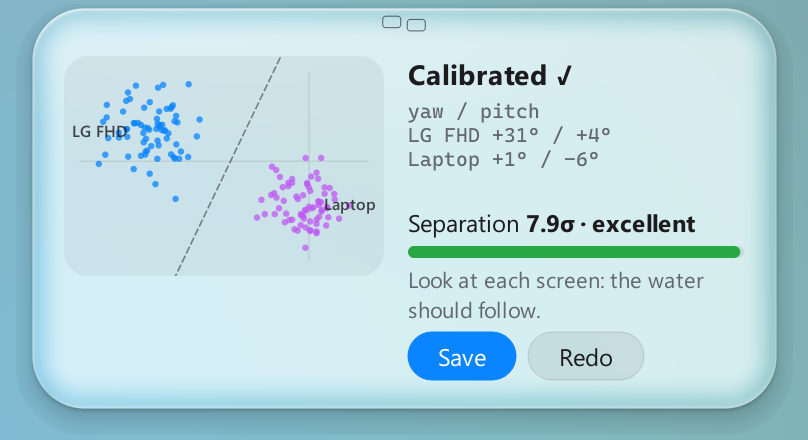
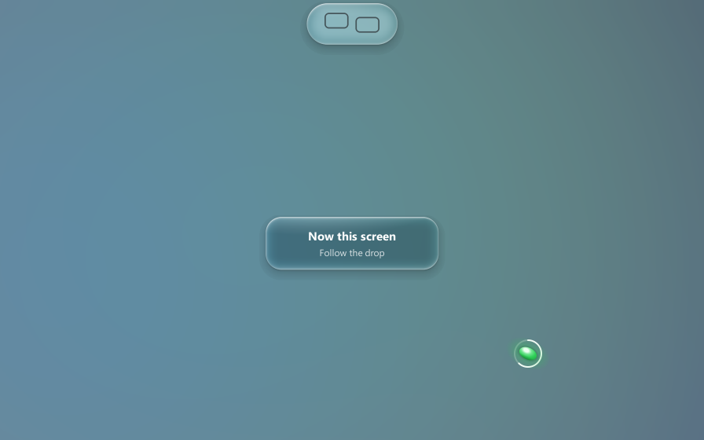

# GazeFocus

**Focus follows your gaze**, for a laptop with one external monitor on Windows. Look at a screen, and keyboard focus moves to the last window you used there. The laptop's own webcam watches which way your head is turned; nothing else is needed.

A small Liquid Glass status dock sits under the laptop camera. The bigger of its two tiles holds the water: that's where focus is.


*The dock, left to right: focus on the laptop · on the external monitor · frozen while you type · no face · paused · needs you.*

<p>


</p>

*Hover the dock for the live preview and the numbers. After a calibration, it shows how well the two screens separate.*

## What it does
- **Moves focus to the screen you look at**, to the window you last used on it.
- **Never fights you:**
  - It freezes while you type, and it never steals a click or a drag.
  - A short cooldown follows any focus change you make yourself.
  - It warps the mouse to the new screen only when the mouse has been idle.
- **Calibrates in about 17 seconds:** follow a glowing drop around each screen with your eyes. The dock then shows how well the two screens separate, and lets you try the result live before you save it.
- **Gets out of the way:** it hides under fullscreen apps and while the screen is locked. The camera is released whenever you pause (Ctrl+Alt+G), the screen locks, or the PC sleeps.

## Requirements
- **Windows 11** (10 may work; it isn't tested).
- **Exactly two monitors:** a laptop screen, with the webcam on top of it, and one external monitor.
- **A webcam:** plain RGB is enough; no IR or eye tracker.
  - Turn off Windows Studio Effects' *Eye Contact* and *Automatic Framing*. They alter the image the head-pose tracking relies on.
- **[uv](https://docs.astral.sh/uv/)**: it installs the Python 3.12 that MediaPipe needs.

## Install
```bash
git clone <this repo>
cd GazeFocus
uv sync
uv run python scripts/fetch_model.py   # MediaPipe's face model (Apache-2.0), SHA-256 checked
```

## Run
- **Without a console:** double-click `.venv\Scripts\gazefocus-app.exe`. You can pin it, make a shortcut, or put a shortcut in `shell:startup` to start at login.
- **From a terminal:** `uv run gazefocus run`.

A two-tile icon appears in the tray (it may be under the ^ overflow arrow). Quit from the tray. The first start opens the calibration.

### Using it
- **Calibrate:** the tray's Recalibrate, the dock's panel, or a click on the dock while it shows "!".
  1. The dock asks first: **Start** or **Not now**.
  2. The screens dim, and a green drop tours the external monitor, then the laptop. Follow it with your eyes and turn your head naturally. It waits if it can't see your face.
  3. Beeps mark each step: 1 = the external monitor, 2 = the laptop, 3 = done.
  4. The dock shows the result: the samples, the separation, and the water already following the new calibration. **Save** or **Redo**.

  

  - **Esc** cancels at any point, and so do pausing and locking the screen. The previous calibration is kept.
- **The dock:**
  - Amber water under a lid means frozen while you type. Steam means no face. Bars mean paused. "!" means something needs you.
  - **Hover** it for the live camera preview, the numbers, and Pause/Recalibrate. **Click** it to pause.
  - It never takes focus.
- **Video calls:** many laptop webcams can be used by only one app at a time. Press **Ctrl+Alt+G** (or tray → Pause) before a call; this releases the camera. Press it again afterwards.

## Privacy
- Camera frames are processed in memory, on the device, and are **never saved or sent anywhere**. GazeFocus makes no network connections; only the setup script downloads the face model.
- Everything it writes stays in `%APPDATA%\GazeFocus\`:
  - `calibration.json` and `calibration-samples.jsonl`: head angles and timings only, with no images or face positions.
  - `logs\`: `decisions.log` has one line per focus switch or block, including the **title of each window it focused**.
  - Recordings made with `gazefocus watch --record` hold head angles and timings only.

## Commands
| Command | What it does |
|---|---|
| `uv run gazefocus run` | The background app: tray icon, dock, and real focus switching |
| `uv run gazefocus live` | A mirrored camera window with the face box, eye points, head direction, and yaw/pitch (q quits) |
| `uv run gazefocus watch [--record FILE]` | Live: which screen you're looking at, the margin, and the switches it would make (none are made) |
| `uv run gazefocus replay FILE` | Run a recording back through the logic, to tune `config.toml` |
| `uv run gazefocus calibrate-cli` | A terminal calibration: look at the external monitor, then the laptop |
| `uv run gazefocus diag monitors \| windows \| focus EXTERNAL` | Check the Windows side: the layout, the focus targets on each screen, a single focus switch |
| `uv run gazefocus dock-demo` | The dock on its own, cycling through every state (no camera) |
| `uv run gazefocus probe` | A guided measurement of the tracking range and speed on your camera |
| `uv run gazefocus bench [--minutes 10]` | CPU and RAM use against the budget (≤ 2 % CPU, ≤ 300 MB) |
| `uv run python scripts/render_screenshots.py` | Re-render these README images from the app's own drawing code (offscreen) |

## Configuration
`%APPDATA%\GazeFocus\config.toml` is written with every default on first run, and reloaded live when you save it. Some settings you might change:
- `[hotkey] pause` (`Ctrl+Alt+G`)
- `[decider] typing_freeze_ms` (how long typing holds focus)
- `[camera] fps` / `idle_fps` / `battery_fps`
- `[dock] scale`, `enabled`, `monitor` (which screen is the laptop)

## How it works
1. **Head pose:** MediaPipe's Face Landmarker turns each camera frame into head yaw and pitch, plus the iris position.
2. **Calibration:** a two-class discriminant over (yaw, pitch, iris), fitted from the calibration samples. It ignores frames caught mid-turn and rejects inputs far from either screen.
3. **The decision:** a smoothed margin with hysteresis. It switches only when the margin is clear, you aren't typing or holding a mouse button, and no cooldown is running.
4. **The switch:** the most recently used window on that screen comes to the front through the Win32 foreground rules, with Raw Input and WinEvent hooks. There's never a keyboard hook, so it adds no typing latency.
5. **The dock and overlay:** a Qt window that renders its own glass, on the CPU, from a capture of what's behind it. It's excluded from screen capture and paced by the display's refresh.

Design: [`docs/superpowers/specs/2026-09-29-gazefocus-design.md`](docs/superpowers/specs/2026-09-29-gazefocus-design.md). Per-file docs: [`docs/reference/gazefocus/`](docs/reference/gazefocus/) (index in [`docs/treestruct.md`](docs/treestruct.md)).

## Limitations
- Exactly two screens, and a webcam on the laptop. It tells left from right with your head; it isn't a pixel-accurate gaze tracker.
- Calibrate again if you move the external monitor, change how you sit, or change the display layout. The dock shows "!" when the layout changes.
- Windows only.

## Development
```bash
uv run pytest                     # ~500 tests, no camera needed (three need the downloaded model)
uv run --with ruff ruff check     # lint
```
- Tests never move the real focus, open the camera or play audio. The Qt ones run on the offscreen platform.
- Don't run two test sessions at once: one test registers a global hotkey.

## License
[MIT](LICENSE).

GazeFocus uses MediaPipe and its Face Landmarker model (Apache-2.0), PySide6 / Qt (LGPL-3.0), OpenCV (Apache-2.0), NumPy (BSD), psutil (BSD) and comtypes (MIT).
